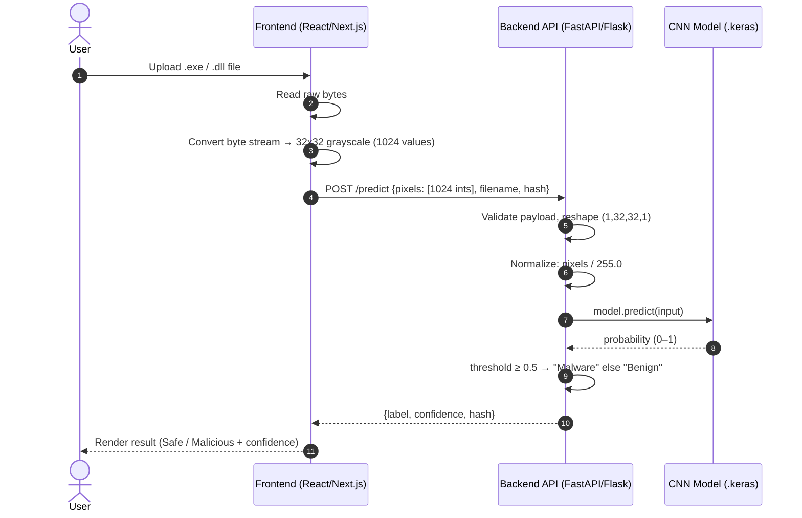
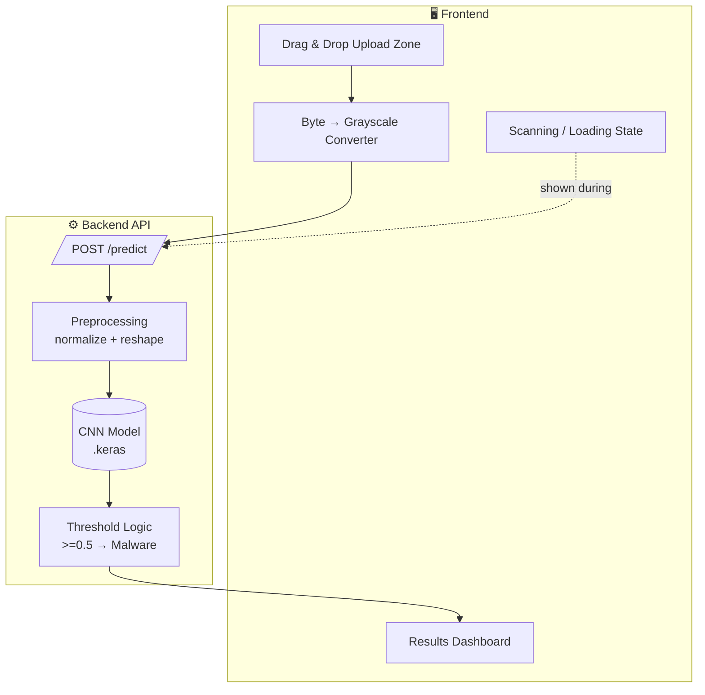
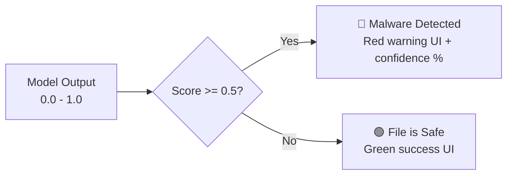
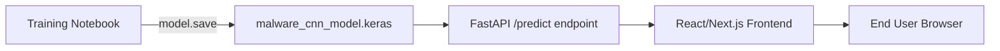

# Part 2 — Frontend + Backend Serving Architecture

### 2.1 End-to-End Request Flow

### 2.2 Component Architecture

### 2.3 ⚖️ Design Decision — Byte Extraction / Resizing Strategy

The notebook's dataset description says the original pipeline used **nearest-neighbor interpolation over the entire PE byte stream**, not a simple truncation to the first 1024 bytes. This matters for inference-time consistency:

<table>
<tr>
<th>Option</th><th>Approach</th><th>Recommendation</th>
</tr>
<tr>
<td><b>A. Truncate/Pad</b></td>
<td>Take first 1024 bytes, zero-pad if file is shorter</td>
<td>❌ Simple but diverges from training distribution — headers-only bias</td>
</tr>
<tr>
<td><b>B. Nearest-Neighbor Resize (Recommended)</b></td>
<td>Read full file bytes → reshape to a square-ish 2D array → resize to 32×32 using nearest-neighbor (matches how the training set — <code>raw_pe_images.csv</code> — was generated per its documented methodology)</td>
<td>✅ Matches training-time distribution, keeps model calibration valid</td>
</tr>
</table>

> Whichever is chosen, use the **identical algorithm client-side (or server-side) that generated the training CSV** — a mismatch here is the single most common cause of silent accuracy degradation between offline eval and production.

### 2.4 Prediction → UI Mapping

---

## 🎨 Frontend Design Spec

<table>
<tr><td><b>Stack</b></td><td>React.js / Next.js · Tailwind CSS · FastAPI (Python) backend</td></tr>
<tr><td><b>Theme</b></td><td>Dark mode default (<code>#0f172a</code>) — cybersecurity aesthetic</td></tr>
<tr><td><b>Accent colors</b></td><td>🟢 <code>#10b981</code> safe · 🔴 <code>#ef4444</code> threat</td></tr>
<tr><td><b>Typography</b></td><td>Inter / Roboto, clean sans-serif</td></tr>
</table>

<b>🧱 UI Components checklist</b>

- [ ] Hero section — title + short description
- [ ] Drag & drop upload zone with hover/pulse micro-animations
- [ ] Radar-sweep / progress-bar loading state during backend processing
- [ ] Results dashboard:
  - Status badge (checkmark = safe, shield/warning = malware)
  - Circular confidence-score progress ring
  - File hash (MD5/SHA-256) + file size for an analytical feel

---

## 📂 Deployment Summary

