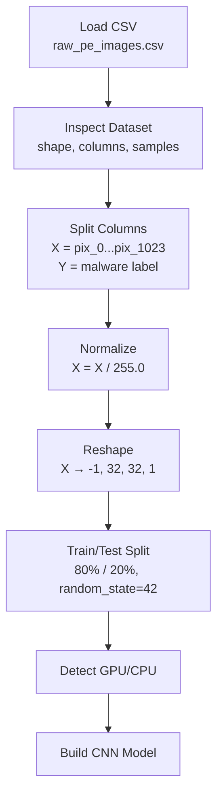
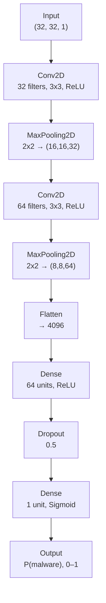
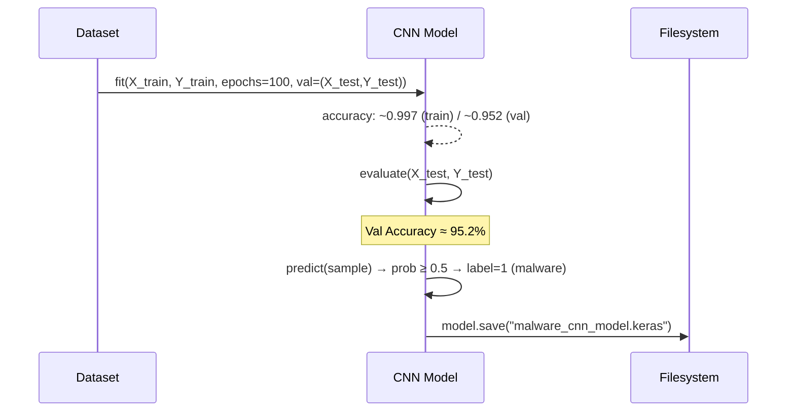

## Part 1 — ML Model Training Pipeline

### 1.1 Data Pipeline

<b>📄 Dataset schema</b> (click to expand)

| Column(s) | Description |
|---|---|
| `hash` | Unique file identifier (dropped before training) |
| `pix_0` … `pix_1023` | Grayscale pixel values (0–255), flattened 32×32 image of the PE byte stream |
| `malware` | Label — `1` = malware, `0` = benign |

**Shape:** `(51959, 1026)` → `X: (51959, 1024)`, `Y: (51959,)`

### 1.2 CNN Architecture

<table>
<thead>
<tr><th>Layer</th><th>Output Shape</th><th>Params</th></tr>
</thead>
<tbody>
<tr><td>Conv2D (32, 3x3)</td><td>(None, 32, 32, 32)</td><td>320</td></tr>
<tr><td>MaxPooling2D (2x2)</td><td>(None, 16, 16, 32)</td><td>0</td></tr>
<tr><td>Conv2D (64, 3x3)</td><td>(None, 16, 16, 64)</td><td>18,496</td></tr>
<tr><td>MaxPooling2D (2x2)</td><td>(None, 8, 8, 64)</td><td>0</td></tr>
<tr><td>Flatten</td><td>(None, 4096)</td><td>0</td></tr>
<tr><td>Dense (64, ReLU)</td><td>(None, 64)</td><td>262,208</td></tr>
<tr><td>Dropout (0.5)</td><td>(None, 64)</td><td>0</td></tr>
<tr><td>Dense (1, Sigmoid)</td><td>(None, 1)</td><td>65</td></tr>
</tbody>
</table>

**Total params:** 281,089 (1.07 MB) &nbsp;|&nbsp; **Optimizer:** Adam &nbsp;|&nbsp; **Loss:** Binary Crossentropy &nbsp;|&nbsp; **Epochs:** 100 &nbsp;|&nbsp; **Batch size:** 32

### 1.3 Training → Evaluation → Export

> ⚠️ **Observation:** training accuracy climbs to ~99.7% while validation loss rises steadily after ~epoch 15–20 (val_loss 0.14 → 1.2+). This is classic **overfitting** — worth addressing with early stopping, L2 regularization, or data augmentation before production deployment.

---
