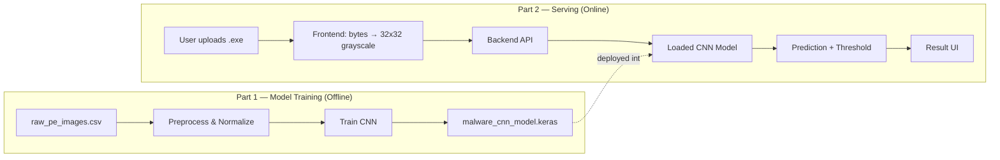
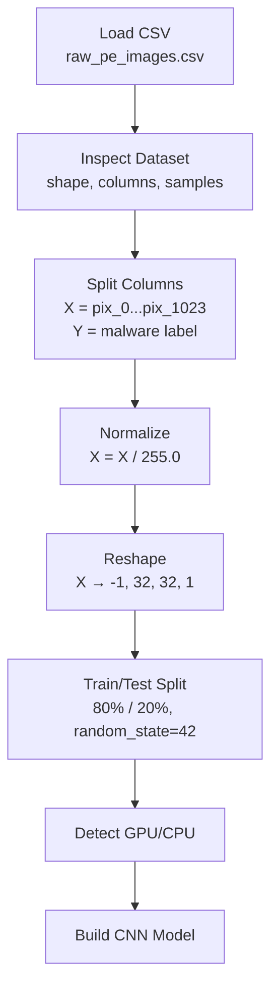
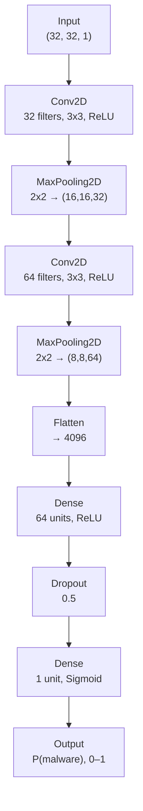
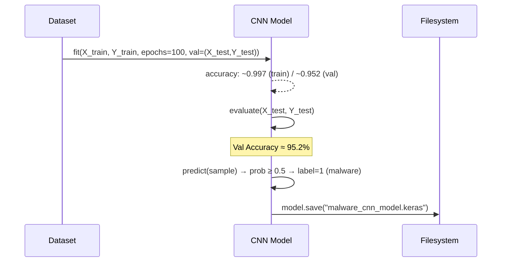
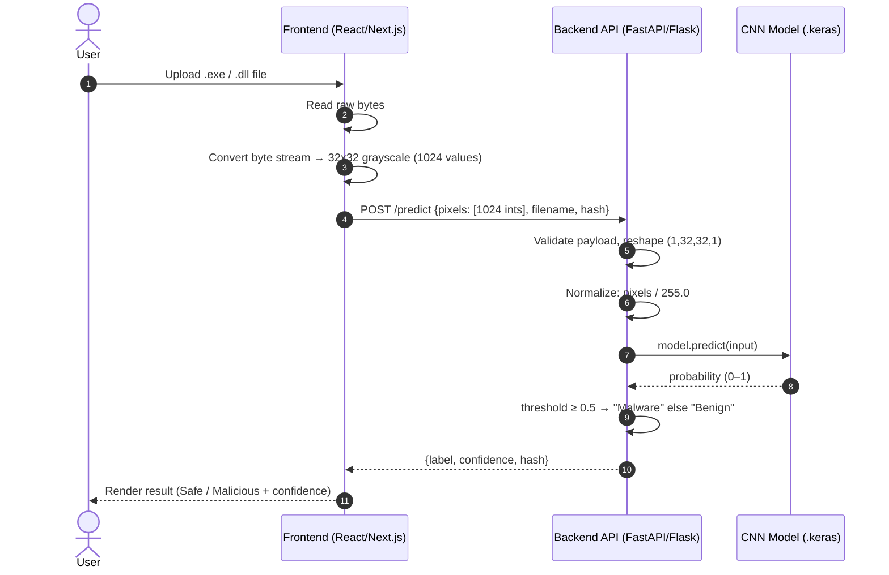
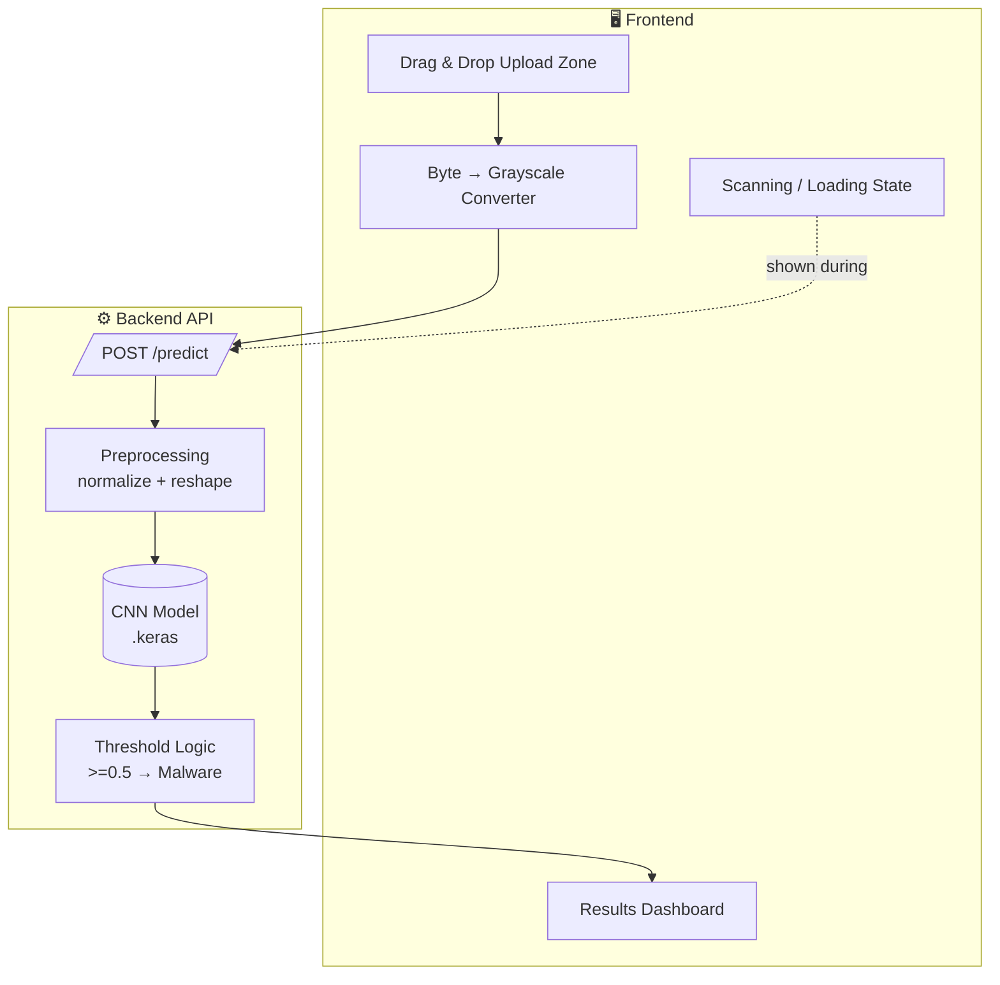
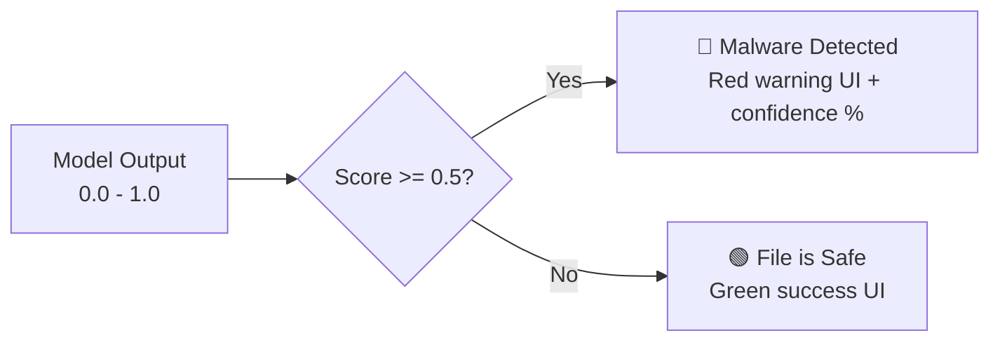
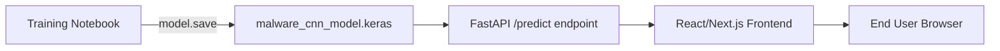

<h1 align="center">🛡️ Malware Detection — System Architecture</h1>

  <b>CNN-based static malware classification from raw PE byte images</b> 
  Two-part architecture: Model Training Pipeline + Frontend/Backend Serving Layer

---

## 📌 Overview

<table>
<tr>
<td><b>Problem</b></td>
<td>Signature-based malware detection fails against new or modified malware variants. This system uses a CNN trained on raw PE byte images to generalize to unseen threats.</td>
</tr>
<tr>
<td><b>Approach</b></td>
<td>Each PE file's raw byte stream is rescaled (nearest-neighbor interpolation) into a 32×32 grayscale image (1024 bytes flattened). A CNN classifies the image as <code>malware</code> or <code>benign</code>.</td>
</tr>
<tr>
<td><b>Dataset</b></td>
<td>51,959 samples × 1024 pixel columns + hash + label. Malware sourced from VirusShare; goodware from PortableApps and Windows 7 x86 system directories.</td>
</tr>
</table>

---

## 🧩 System at a Glance

---

## Part 1 — ML Model Training Pipeline

### 1.1 Data Pipeline

<b>📄 Dataset schema</b> (click to expand)

| Column(s) | Description |
|---|---|
| `hash` | Unique file identifier (dropped before training) |
| `pix_0` … `pix_1023` | Grayscale pixel values (0–255), flattened 32×32 image of the PE byte stream |
| `malware` | Label — `1` = malware, `0` = benign |

**Shape:** `(51959, 1026)` → `X: (51959, 1024)`, `Y: (51959,)`

### 1.2 CNN Architecture

<table>
<thead>
<tr><th>Layer</th><th>Output Shape</th><th>Params</th></tr>
</thead>
<tbody>
<tr><td>Conv2D (32, 3x3)</td><td>(None, 32, 32, 32)</td><td>320</td></tr>
<tr><td>MaxPooling2D (2x2)</td><td>(None, 16, 16, 32)</td><td>0</td></tr>
<tr><td>Conv2D (64, 3x3)</td><td>(None, 16, 16, 64)</td><td>18,496</td></tr>
<tr><td>MaxPooling2D (2x2)</td><td>(None, 8, 8, 64)</td><td>0</td></tr>
<tr><td>Flatten</td><td>(None, 4096)</td><td>0</td></tr>
<tr><td>Dense (64, ReLU)</td><td>(None, 64)</td><td>262,208</td></tr>
<tr><td>Dropout (0.5)</td><td>(None, 64)</td><td>0</td></tr>
<tr><td>Dense (1, Sigmoid)</td><td>(None, 1)</td><td>65</td></tr>
</tbody>
</table>

**Total params:** 281,089 (1.07 MB) &nbsp;|&nbsp; **Optimizer:** Adam &nbsp;|&nbsp; **Loss:** Binary Crossentropy &nbsp;|&nbsp; **Epochs:** 100 &nbsp;|&nbsp; **Batch size:** 32

### 1.3 Training → Evaluation → Export

> ⚠️ **Observation:** training accuracy climbs to ~99.7% while validation loss rises steadily after ~epoch 15–20 (val_loss 0.14 → 1.2+). This is classic **overfitting** — worth addressing with early stopping, L2 regularization, or data augmentation before production deployment.

---

## Part 2 — Frontend + Backend Serving Architecture

### 2.1 End-to-End Request Flow

### 2.2 Component Architecture

### 2.3 ⚖️ Design Decision — Byte Extraction / Resizing Strategy

The notebook's dataset description says the original pipeline used **nearest-neighbor interpolation over the entire PE byte stream**, not a simple truncation to the first 1024 bytes. This matters for inference-time consistency:

<table>
<tr>
<th>Option</th><th>Approach</th><th>Recommendation</th>
</tr>
<tr>
<td><b>A. Truncate/Pad</b></td>
<td>Take first 1024 bytes, zero-pad if file is shorter</td>
<td>❌ Simple but diverges from training distribution — headers-only bias</td>
</tr>
<tr>
<td><b>B. Nearest-Neighbor Resize (Recommended)</b></td>
<td>Read full file bytes → reshape to a square-ish 2D array → resize to 32×32 using nearest-neighbor (matches how the training set — <code>raw_pe_images.csv</code> — was generated per its documented methodology)</td>
<td>✅ Matches training-time distribution, keeps model calibration valid</td>
</tr>
</table>

> Whichever is chosen, use the **identical algorithm client-side (or server-side) that generated the training CSV** — a mismatch here is the single most common cause of silent accuracy degradation between offline eval and production.

### 2.4 Prediction → UI Mapping

---

## 🎨 Frontend Design Spec

<table>
<tr><td><b>Stack</b></td><td>React.js / Next.js · Tailwind CSS · FastAPI (Python) backend</td></tr>
<tr><td><b>Theme</b></td><td>Dark mode default (<code>#0f172a</code>) — cybersecurity aesthetic</td></tr>
<tr><td><b>Accent colors</b></td><td>🟢 <code>#10b981</code> safe · 🔴 <code>#ef4444</code> threat</td></tr>
<tr><td><b>Typography</b></td><td>Inter / Roboto, clean sans-serif</td></tr>
</table>

<b>🧱 UI Components checklist</b>

- [ ] Hero section — title + short description
- [ ] Drag & drop upload zone with hover/pulse micro-animations
- [ ] Radar-sweep / progress-bar loading state during backend processing
- [ ] Results dashboard:
  - Status badge (checkmark = safe, shield/warning = malware)
  - Circular confidence-score progress ring
  - File hash (MD5/SHA-256) + file size for an analytical feel

---

## 📂 Deployment Summary

