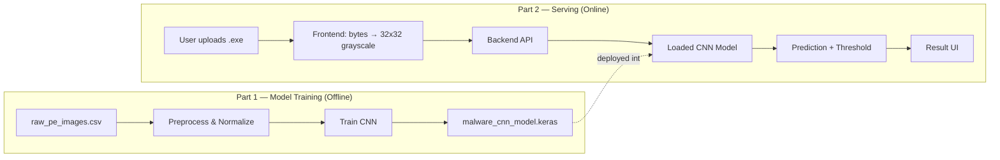

<h1 align="center">🛡️ Malware Detection — System Architecture</h1>

  <b>CNN-based static malware classification from raw PE byte images</b> 
  Two-part architecture: Model Training Pipeline + Frontend/Backend Serving Layer

---

## 📌 Overview

<table>
<tr>
<td><b>Problem</b></td>
<td>Signature-based malware detection fails against new or modified malware variants. This system uses a CNN trained on raw PE byte images to generalize to unseen threats.</td>
</tr>
<tr>
<td><b>Approach</b></td>
<td>Each PE file's raw byte stream is rescaled (nearest-neighbor interpolation) into a 32×32 grayscale image (1024 bytes flattened). A CNN classifies the image as <code>malware</code> or <code>benign</code>.</td>
</tr>
<tr>
<td><b>Dataset</b></td>
<td>51,959 samples × 1024 pixel columns + hash + label. Malware sourced from VirusShare; goodware from PortableApps and Windows 7 x86 system directories.</td>
</tr>
</table>

---

## 🧩 System at a Glance

---

